# MCP Svelte Docs Architecture

## Overview

This MCP server provides a comprehensive reference guide for Svelte 5, helping LLMs provide accurate guidance when users are working with Svelte. While it includes migration patterns from Svelte 4 to Svelte 5, it also serves as a detailed reference for Svelte 5 features, common mistakes, and best practices.

```mermaid
graph TD
    A[MCP Svelte Docs Server] --> B[Pattern Database]
    A --> C[Tool Implementation]
    A --> R[Resource Implementation]
    
    B --> B1[Migration Patterns]
    B --> B2[Svelte 5 Features]
    B --> B3[Common Mistakes]
    B --> B4[Global State Patterns]
    
    B1 --> B1a[State Management]
    B1 --> B1b[Event Handling]
    B1 --> B1c[Props & Components]
    B1 --> B1d[Templating]
    B1 --> B1e[Lifecycle]
    
    B2 --> B2a[Runes]
    B2 --> B2b[Snippets]
    B2 --> B2c[Props]
    B2 --> B2d[Events]
    
    B3 --> B3a[Reactivity Mistakes]
    B3 --> B3b[Event Handling Mistakes]
    B3 --> B3c[Props Mistakes]
    
    B4 --> B4a[Function-based]
    B4 --> B4b[Object-based]
    B4 --> B4c[Class-based]
    B4 --> B4d[Context-based]
    
    C --> D1[svelte_pattern Tool]
    C --> D2[svelte5_feature Tool]
    C --> D3[svelte5_common_mistakes Tool]
    
    R --> R1[Direct Resources]
    R --> R2[Resource Templates]
    
    D1 --> E1[Migration Pattern Lookup]
    D2 --> E2[Feature Lookup]
    D3 --> E3[Mistakes Lookup]
    
    E1 --> F1[Return Svelte 4/5 Examples]
    E2 --> F2[Return Feature Documentation]
    E3 --> F3[Return Mistakes & Corrections]
```



## Implementation Status

✅ **Completed**:
- Server architecture design
- MCP server implementation (index.ts)
- Configuration handling (config.ts)
- Tool registration (tools/handler.ts)
- Migration pattern database structure
- Migration pattern implementations:
  - State management patterns (state.ts)
  - Event handling patterns (events.ts)
  - Props & components patterns (props.ts)
  - Templating patterns (templating.ts)
  - Lifecycle patterns (lifecycle.ts)
- Enhanced tool implementations:
  - svelte5_feature tool
  - svelte5_common_mistakes tool
- New pattern implementations:
  - Svelte 5 features (svelte5_features.ts)
  - Common mistakes (common_mistakes.ts)
  - Global state patterns (global_state.ts)
- Resource implementation:
  - Direct resources
  - Resource templates
- MCP configuration in Cline settings
- Testing with all tools and resources

🔄 **Future Enhancements**:
- Add more pattern examples across all categories
- Add TypeScript versions for all migration patterns
- Improve categorization for common mistakes
- Add more detailed documentation for resources
- Add more global state patterns

## Server Structure

### Current Structure

```
src/
├── index.ts                # MCP server entry point
├── config.ts               # Basic configuration
├── tools/                  # Tool implementations
│   └── handler.ts          # Tool registration
├── resources/              # Resource implementations
│   ├── index.ts            # Resource registration
│   ├── direct.ts           # Direct resources
│   └── templates.ts        # Resource templates
└── patterns/               # Pattern database
    ├── index.ts            # Exports all patterns
    ├── state.ts            # State management patterns
    ├── events.ts           # Event handling patterns
    ├── props.ts            # Props and component patterns
    ├── templating.ts       # Templating patterns
    ├── lifecycle.ts        # Lifecycle patterns
    ├── svelte5_features.ts # Svelte 5 specific features
    ├── common_mistakes.ts  # Common mistakes and corrections
    └── global_state.ts     # Global state patterns
```

## Pattern Formats

### Migration Pattern Format

Each migration pattern file exports an array of examples with the following structure:

```typescript
export default [
  {
    name: "Pattern Name",
    description: "Description of the pattern",
    svelte4: `Svelte 4 code example`,
    svelte5: `Svelte 5 code example`,
    notes: "Additional notes about migration considerations"
  }
]
```

### Svelte 5 Feature Pattern Format

For Svelte 5-specific features, we'll use an enhanced format:

```typescript
export default [
  {
    name: "Feature Name",
    description: "Description of the feature",
    examples: [
      {
        code: `Code example 1`,
        explanation: "Explanation of example 1"
      },
      {
        code: `Code example 2`,
        explanation: "Explanation of example 2"
      }
    ],
    bestPractices: [
      "Best practice 1",
      "Best practice 2"
    ]
  }
]
```

### Common Mistakes Pattern Format

For common mistakes and corrections:

```typescript
export default [
  {
    name: "Mistake Name",
    description: "Description of the common mistake",
    mistake: `Incorrect code example`,
    correction: `Corrected code example`,
    explanation: "Detailed explanation of why the mistake is problematic and how the correction addresses it"
  }
]
```

### Global State Pattern Format

For global state patterns:

```typescript
export default [
  {
    name: "Global State Pattern Name",
    description: "Description of the global state pattern",
    code: `Implementation example`,
    usage: `Usage example`,
    notes: "Additional notes about the pattern, including considerations for server vs. client usage"
  }
]
```

## Tool Implementation

### svelte_pattern Tool (Existing)

The server currently exposes a tool called `svelte_pattern` that accepts a pattern name or category and returns matching migration examples:

```typescript
// Tool schema
{
  name: 'svelte_pattern',
  description: 'Get Svelte 4 to Svelte 5 migration patterns',
  inputSchema: {
    type: 'object',
    properties: {
      pattern: {
        type: 'string',
        description: 'Pattern name or category to search for'
      }
    },
    required: ['pattern']
  }
}
```

### svelte5_feature Tool

A new tool for accessing Svelte 5 feature documentation:

```typescript
// Tool schema
{
  name: 'svelte5_feature',
  description: 'Get detailed information about Svelte 5 features',
  inputSchema: {
    type: 'object',
    properties: {
      feature: {
        type: 'string',
        description: 'Feature name (e.g., "runes", "snippets", "props")'
      },
      includeExamples: {
        type: 'boolean',
        description: 'Whether to include code examples'
      }
    },
    required: ['feature']
  }
}
```

### svelte5_common_mistakes Tool

A new tool for accessing common mistakes and corrections:

```typescript
// Tool schema
{
  name: 'svelte5_common_mistakes',
  description: 'Get common mistakes and corrections for Svelte 5 features',
  inputSchema: {
    type: 'object',
    properties: {
      feature: {
        type: 'string',
        description: 'Feature name (e.g., "runes", "snippets", "events")'
      }
    },
    required: ['feature']
  }
}
```

## Content Categories

### 1. Migration Patterns

#### State Management
- Basic state (`let` → `$state`)
- Derived state (`$:` → `$derived`)
- Effects (`$:` → `$effect`)
- Reactive declarations
- Store usage
- Arrays and objects

#### Event Handling
- Basic DOM events (`on:click` → `onclick`)
- Event modifiers
- Component events (event dispatching → callback props)
- Multiple event handlers
- Event delegation
- Form events

#### Props & Components
- Basic props (`export let` → `$props`)
- Default values
- Spread props
- Component instantiation
- Component binding
- Component exports

#### Templating
- Conditionals
- Loops
- Slots vs Snippets
- HTML content
- Dynamic components
- Keyed blocks

#### Lifecycle
- Component initialization
- Cleanup
- DOM updates
- Transitions

### 2. Svelte 5 Features

#### Runes
- $state
- $state.raw
- $state.snapshot
- $derived
- $derived.by
- $effect
- $effect.pre
- $effect.tracking
- $props
- $bindable
- $inspect
- $host

#### Snippets
- Basic snippet usage
- Snippet parameters
- Snippet scoping
- Passing snippets to components
- Recursive snippets

#### Props
- Basic props usage
- Destructuring props
- Default values
- Spread props
- TypeScript integration

#### Events
- Basic event handling
- Event handler shorthand
- Component callbacks
- Event forwarding
- Event handler composition

### 3. Common Mistakes

#### Reactivity Mistakes
- Forgetting to use $state
- Directly mutating objects without reactivity
- Incorrect usage of $derived
- Misunderstanding reactivity boundaries
- Unnecessary $effect usage

#### Event Handling Mistakes
- Using on:click instead of onclick
- Trying to use event modifiers
- Multiple event handlers syntax
- Event bubbling misconceptions

#### Props Mistakes
- Using export let instead of $props
- Incorrect props destructuring
- Type errors with props

### 4. Global State Patterns

#### Function-based Approaches
- Getter/setter functions
- Module-level state

#### Object-based Approaches
- Objects with getters/setters
- Proxy-based reactivity

#### Class-based Approaches
- Classes with reactive properties
- Singleton patterns

#### Context-based Approaches
- Using Svelte contexts
- Safe patterns for isomorphic apps

## Resource Implementation

### Direct Resources

```typescript
[
  {
    uri: "svelte5://overview",
    name: "Svelte 5 Overview",
    description: "Overview of Svelte 5 features and changes",
    mimeType: "text/plain"
  },
  {
    uri: "svelte5://runes/overview",
    name: "Runes Overview",
    description: "Overview of all runes in Svelte 5",
    mimeType: "text/plain"
  },
  {
    uri: "svelte5://snippets/overview",
    name: "Snippets Overview",
    description: "Overview of snippets in Svelte 5",
    mimeType: "text/plain"
  },
  {
    uri: "svelte5://global-state/overview",
    name: "Global State Overview",
    description: "Overview of global state approaches in Svelte 5",
    mimeType: "text/plain"
  }
]
```

### Resource Templates

```typescript
[
  {
    uriTemplate: "svelte5://runes/{rune_name}",
    name: "Rune Reference",
    description: "Detailed reference for a specific rune",
    mimeType: "text/plain"
  },
  {
    uriTemplate: "svelte5://patterns/{category}/{pattern_name}",
    name: "Pattern Reference",
    description: "Reference for a specific Svelte pattern",
    mimeType: "text/plain"
  },
  {
    uriTemplate: "svelte5://mistakes/{category}",
    name: "Common Mistakes",
    description: "Common mistakes for a specific category",
    mimeType: "text/plain"
  }
]
```

## Usage Flow

### Migration Pattern Flow
1. LLM receives a question about migrating from Svelte 4 to 5
2. LLM identifies relevant pattern category
3. LLM calls the `svelte_pattern` tool with the pattern name
4. Tool returns matching patterns with Svelte 4 and 5 examples
5. LLM uses the examples to provide migration guidance

### Svelte 5 Feature Flow
1. LLM receives a question about a Svelte 5 feature
2. LLM identifies the specific feature
3. LLM either:
   - Calls the `svelte5_feature` tool with the feature name
   - Accesses the relevant resource directly (e.g., `svelte5://runes/state`)
4. LLM uses the detailed documentation to provide accurate guidance

### Common Mistakes Flow
1. LLM detects potential mistakes in user code
2. LLM calls the `svelte5_common_mistakes` tool with the relevant feature
3. LLM uses the mistake patterns to identify and correct issues

## Example Tool Usage

### svelte_pattern Tool (Existing)

```
<use_mcp_tool>
<server_name>mcp-svelte-docs-testing</server_name>
<tool_name>svelte_pattern</tool_name>
<arguments>
{
  "pattern": "event"
}
</arguments>
</use_mcp_tool>
```

Example response:

```json
{
  "patterns": [
    {
      "name": "Basic event handling",
      "description": "How to handle click events",
      "svelte4": "<script>\n  let count = 0;\n\n  function handleClick() {\n    count++;\n  }\n</script>\n\n<button on:click={handleClick}>\n  Clicked {count} times\n</button>",
      "svelte5": "<script>\n  let count = $state(0);\n\n  function handleClick() {\n    count++;\n  }\n</script>\n\n<button onclick={handleClick}>\n  Clicked {count} times\n</button>",
      "notes": "In Svelte 5, event handlers use standard HTML attributes (onclick) instead of the directive syntax (on:click)."
    }
  ]
}
```

### svelte5_feature Tool (Planned)

```
<use_mcp_tool>
<server_name>mcp-svelte-docs-testing</server_name>
<tool_name>svelte5_feature</tool_name>
<arguments>
{
  "feature": "snippets",
  "includeExamples": true
}
</arguments>
</use_mcp_tool>
```

Example response:

```json
{
  "feature": {
    "name": "Snippets",
    "description": "Snippets are a new feature in Svelte 5 that allow you to define reusable chunks of markup inside your components.",
    "examples": [
      {
        "code": "{#snippet figure(image)}\n<figure>\n  \n  <figcaption>{image.caption}</figcaption>\n</figure>\n{/snippet}\n\n{@render figure(headerImage)}",
        "explanation": "This example defines a snippet called 'figure' that takes an image object as a parameter and renders a figure element with an image and caption. The snippet is then rendered with the headerImage object."
      }
    ],
    "bestPractices": [
      "Use snippets to reduce duplication in your templates",
      "Snippets can be passed as props to components",
      "Snippets have lexical scoping rules - they are only visible in the same scope they are defined in"
    ]
  }
}
```

### svelte5_common_mistakes Tool (Planned)

```
<use_mcp_tool>
<server_name>mcp-svelte-docs-testing</server_name>
<tool_name>svelte5_common_mistakes</tool_name>
<arguments>
{
  "feature": "runes"
}
</arguments>
</use_mcp_tool>
```

Example response:

```json
{
  "mistakes": [
    {
      "name": "Exporting state directly",
      "description": "Directly exporting a stateful variable from a module",
      "mistake": "// counter.svelte.js\nlet count = $state(0);\n\nexport { count };",
      "correction": "// counter.svelte.js\nlet count = $state(0);\n\nexport function getCount() {\n  return count;\n}\n\nexport function setCount(value) {\n  count = value;\n}",
      "explanation": "When you export a stateful variable directly, the reactivity is lost when it's imported elsewhere. This is because the importing module only gets the current value, not the reactive binding. Instead, export functions that access and modify the state."
    }
  ]
}
```

### Resource Access (Planned)

```
<access_mcp_resource>
<server_name>mcp-svelte-docs-testing</server_name>
<uri>svelte5://runes/state</uri>
</access_mcp_resource>
```

Example response:

```
# $state Rune

The $state rune is used to declare reactive state in Svelte 5.

## Basic Usage

```svelte
<script>
  let count = $state(0);
  
  function increment() {
    count++;
  }
</script>

<button onclick={increment}>
  Clicked {count} times
</button>
```

## Deep Reactivity

When you pass an object or array to $state, it becomes deeply reactive:

```svelte
<script>
  let user = $state({
    name: 'John',
    age: 30
  });
  
  function birthday() {
    user.age++;
  }
</script>

<div>
  <p>{user.name} is {user.age} years old</p>
  <button onclick={birthday}>Birthday!</button>
</div>
```

## Variants

- $state.raw: For large arrays/objects that don't need deep reactivity
- $state.snapshot: Take a static snapshot of state

## Common Mistakes

- Don't export $state variables directly from modules
- Don't reassign $state objects, mutate their properties instead
```

## Future Enhancements

- Add more pattern examples across all categories
- Expand the resource content with more detailed documentation
- Add interactive examples with embedded REPLs
- Add SvelteKit 2 integration patterns
- Add TypeScript-specific patterns and examples
- Add performance optimization guidelines
- Add accessibility best practices
- Add testing strategies for Svelte 5 components
- Add server-side rendering considerations
- Add internationalization patterns
