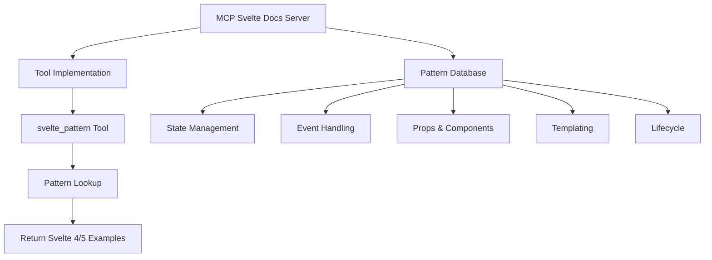

# MCP Svelte Docs Architecture

## Overview

This MCP server provides a simple tool for LLMs to access side-by-side comparisons of Svelte 4 and Svelte 5 code patterns. The goal is to help LLMs provide accurate guidance when users are working with Svelte, especially during migration from Svelte 4 to Svelte 5.



## Server Structure

```
src/
├── index.ts                # MCP server entry point
├── config.ts               # Basic configuration
├── tools/                  # Tool implementations
│   └── handler.ts          # Tool registration
└── patterns/               # Pattern database
    ├── index.ts            # Exports all patterns
    ├── state.ts            # State management patterns
    ├── events.ts           # Event handling patterns
    ├── props.ts            # Props and component patterns
    ├── templating.ts       # Templating patterns
    └── lifecycle.ts        # Lifecycle patterns
```

## Pattern Format

Each pattern file exports an array of examples with the following structure:

```typescript
export default [
  {
    name: "Pattern Name",
    description: "Description of the pattern",
    svelte4: `Svelte 4 code example`,
    svelte5: `Svelte 5 code example`,
    notes: "Additional notes about migration considerations"
  }
]
```

## Tool Implementation

The server will expose a single tool called `svelte_pattern` that accepts a pattern name or category and returns matching examples:

```typescript
// Tool schema
{
  name: 'svelte_pattern',
  description: 'Get Svelte 4 to Svelte 5 migration patterns',
  inputSchema: {
    type: 'object',
    properties: {
      pattern: {
        type: 'string',
        description: 'Pattern name or category to search for'
      }
    },
    required: ['pattern']
  }
}
```

## Pattern Categories

### 1. State Management

- Basic state (`let` → `$state`)
- Derived state (`$:` → `$derived`)
- Effects (`$:` → `$effect`)
- Reactive declarations
- Store usage
- Arrays and objects

### 2. Event Handling

- Basic DOM events (`on:click` → `onclick`)
- Event modifiers
- Component events (event dispatching → callback props)
- Multiple event handlers
- Event delegation
- Form events

### 3. Props & Components

- Basic props (`export let` → `$props`)
- Default values
- Spread props
- Component instantiation
- Component binding
- Component exports

### 4. Templating

- Conditionals
- Loops
- Slots vs Snippets
- HTML content
- Dynamic components
- Keyed blocks

### 5. Lifecycle

- Component initialization
- Cleanup
- DOM updates
- Transitions

## Usage Flow

1. LLM receives a question about Svelte
2. LLM identifies relevant pattern category
3. LLM calls the `svelte_pattern` tool with the pattern name
4. Tool returns matching patterns with Svelte 4 and 5 examples
5. LLM uses the examples to provide accurate guidance

## Example Tool Usage

```
<use_mcp_tool>
<server_name>mcp-svelte-docs</server_name>
<tool_name>svelte_pattern</tool_name>
<arguments>
{
  "pattern": "event"
}
</arguments>
</use_mcp_tool>
```

Expected response:

```json
{
  "patterns": [
    {
      "name": "Basic event handling",
      "description": "How to handle click events",
      "svelte4": "<script>\n  let count = 0;\n\n  function handleClick() {\n    count++;\n  }\n</script>\n\n<button on:click={handleClick}>\n  Clicked {count} times\n</button>",
      "svelte5": "<script>\n  let count = $state(0);\n\n  function handleClick() {\n    count++;\n  }\n</script>\n\n<button onclick={handleClick}>\n  Clicked {count} times\n</button>",
      "notes": "In Svelte 5, event handlers use standard HTML attributes (onclick) instead of the directive syntax (on:click)."
    }
  ]
}
